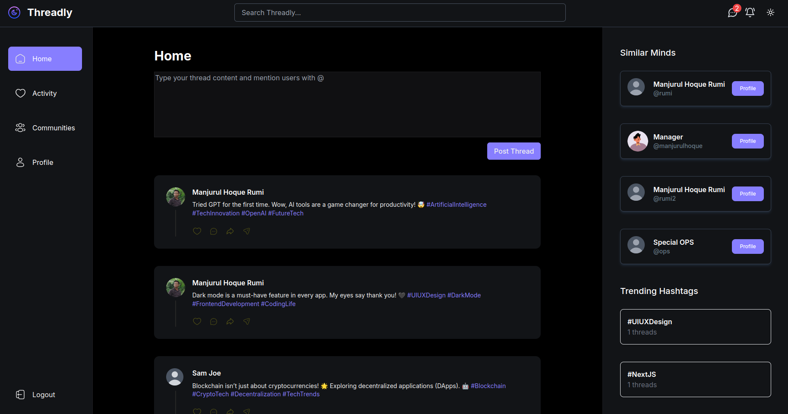
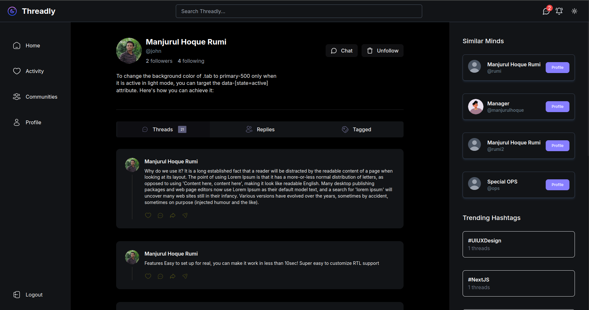
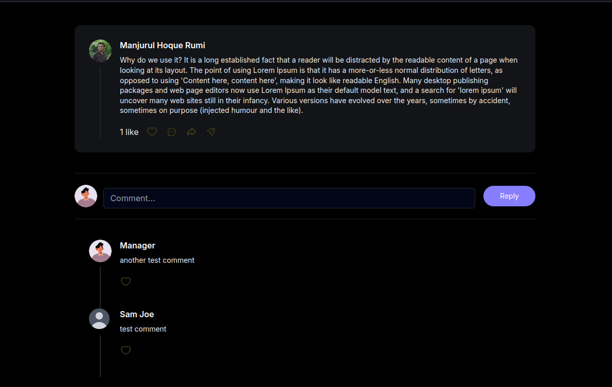
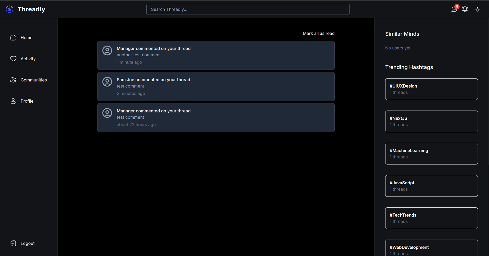
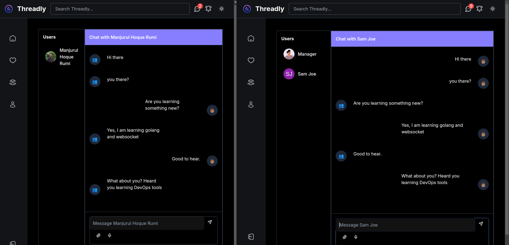

# Threadly

A modern social media platform built with Next.js and Go, featuring real-time messaging, dark mode, and a clean UI.

Live: [Demo](http://threadly.manjurulhoque.com/)

## Features

- 🔐 Authentication with NextAuth.js and JWT
- 🌓 Dark/Light mode theming
- 💬 Real-time chat messaging
- 🧵 Thread creation and interactions
- 💖 Like/Unlike functionality
- 🔔 Real-time notifications
- 👥 User profiles and following system
- 🤝 Community features // todo
- 📱 Responsive design
- 🔍 User search functionality // todo
- 🖼️ Image upload support // todo
- 🌐 WebSocket integration

## Preview

### Home Page


### Profile Page


### Single thread with comments Page


### Notifications Page


### Real time chat Page



## Tech Stack

### Frontend
- ⚛️ Next.js 14 (App Router)
- 🎨 Tailwind CSS
- 🔄 Redux Toolkit
- 🎭 Shadcn/ui Components
- 🎣 React Hook Form
- ✨ TypeScript
- 🔒 NextAuth.js
- 🌐 WebSocket (react-use-websocket)
- 📅 date-fns
- 🎯 Zod Validation

### Backend
- 🚀 Go
- 🎯 Gin Framework
- 🗄️ PostgreSQL
- 🔑 JWT Authentication
- 🔄 GORM
- 🌐 WebSocket
- 🔒 bcrypt

## Getting Started

First, run the development server:

```
Frontend
cd frontend
npm install
npm run dev
```

```
Backend
cd backend
go mod download
go run cmd/app/main.go
```


Open [http://localhost:3000](http://localhost:3000) with your browser to see the result.

## Environment Setup

Create a `.env` file in the frontend directory with the following variables:

env
NEXTAUTH_URL=http://localhost:3000
NEXTAUTH_SECRET=your-secret-key
BACKEND_BASE_URL=http://localhost:8080


Create a `.env` file in the backend directory:

env
DB_HOST=localhost
DB_USER=your-db-user
DB_PASSWORD=your-db-password
DB_NAME=threadly
DB_PORT=5432
JWT_SECRET=your-jwt-secret


## Learn More

To learn more about the technologies used:

- [Next.js Documentation](https://nextjs.org/docs)
- [Tailwind CSS](https://tailwindcss.com/docs)
- [Go Documentation](https://golang.org/doc/)
- [Gin Framework](https://gin-gonic.com/docs/)

